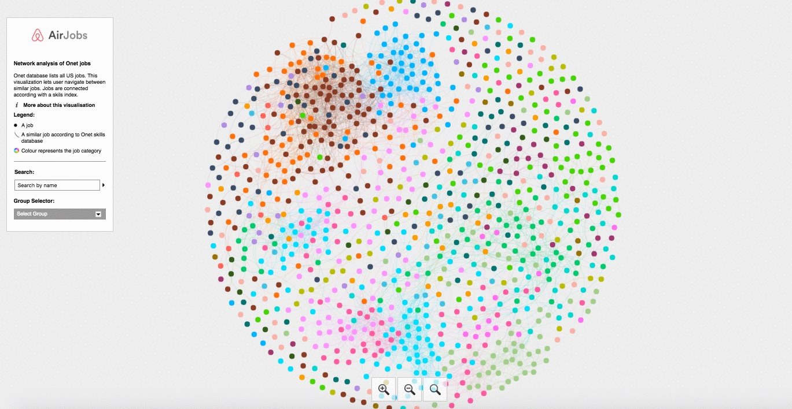
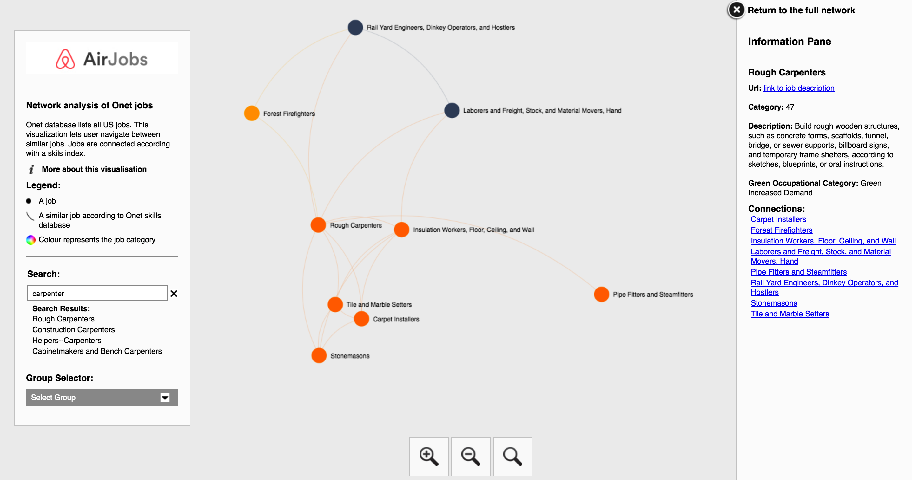
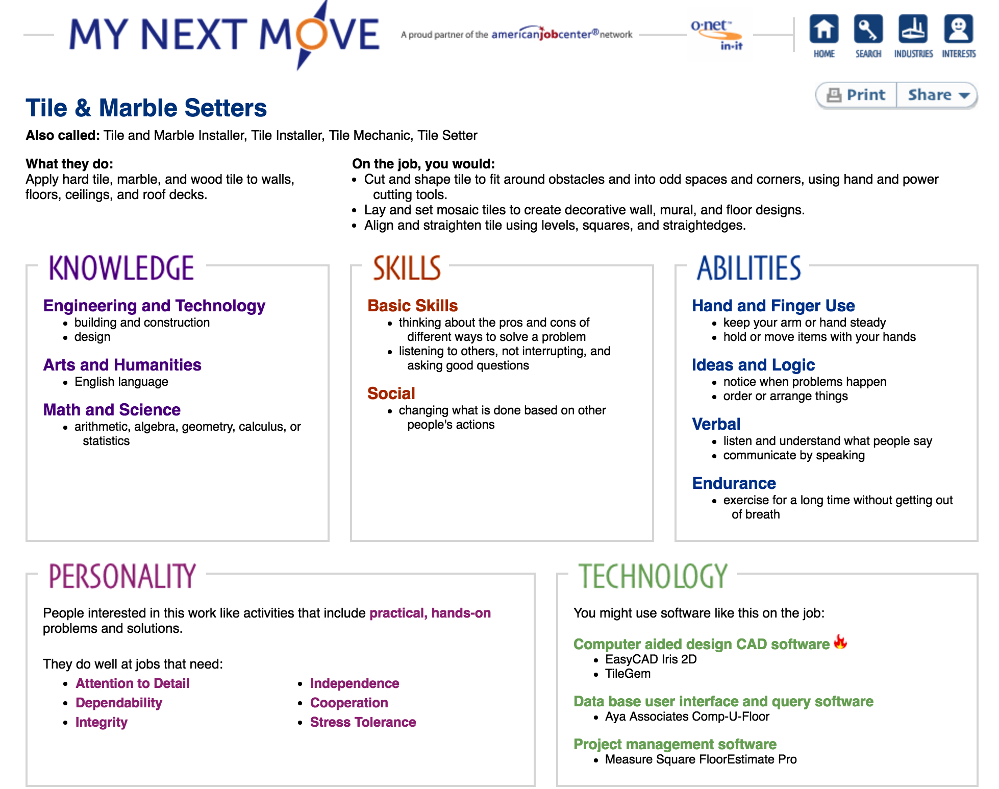

# airjobs
BayesHack2016 Project

### AirJobs Career Explorer

Are you thinking about making a career change, but you're not sure what kind of job is right for you? The AirJobs Career Explorer can help. It takes in information from job-seekers and uses a custom matching algorithm to recommend jobs that best suit each person's situation.

The tool can take in the following information about a job-seeker:
* Skills
* Interests
* Knowledge Areas
* Level of Educational Attainment
* Minimum Acceptible Job Wage
* Preferred States

The user can also input weights to express how important each piece of information is to them in their job search.

#### Images of App in Action

The first image shows the tool in action, with some skills input into the tool.

The second image shows the tool shows the tool's top recommendations given a set of input preferences.

#### Past Context

[MyNextMove](https://www.mynextmove.org/) is a helpful site that leverages the Department of Labor's data about jobs. It allows you to search for careers
with keywords, within individual industries, or along certain interests. However, in the past, job seekers could only search for jobs along one dimension at a time, and they could not weight different preferences differently. Our tool allows a more nuanced and targeted job recommendation approach than is currently available with BLS data.

### Jobs Viz-a-Viz

URL - <a href="https://blooming-ridge-75693.herokuapp.com/"> https://blooming-ridge-75693.herokuapp.com </a>

#### Motivation

We worked on the <a href="http://www.bls.gov/home.htm">Bureau of Labour Statistics</a> (BLS) database to build a tool to enable job seekers to explore the whole universe of jobs in the United States of America. We want to help people with work experience to find jobs related to their current or past employment. The hope is that: 

a) employees with jobs most at risk of **automation** in the next 20 years can find similar jobs with a lower probability of automation; 
b) employees interested in exploring **green** employment can find jobs similar to their current or past employment. 

#### Approach

For each of the 954 jobs in the BLS database, we compute the the coordinates of the job in the 35-dimensional space of skills. These skills are designated by the BLS and include ones such as: *Reading Comprehension*, *Active Listening*, *Writing*, etc.

For each pair of jobs in this skills vector space, we calculate the distance between them using the [Kullback-Leibler Divergence](https://en.wikipedia.org/wiki/Kullback%E2%80%93Leibler_divergence) to give us a scalar. The smaller the distance (*divergence*), the more similar two jobs are in terms of the skills required to be competent in the jobs.

#### Output

A user landing [on the front page](https://blooming-ridge-75693.herokuapp.com/) will see the entire universe of jobs: 

And then, suppose, [a carpenter](https://blooming-ridge-75693.herokuapp.com/#Rough Carpenters), called Sarah, say, is interested in similar jobs to her's then she can search for it in the left pane and see it's network of related jobs: 

Suppose Sarah likes the sound of [*Tile and Marble Setters*](https://blooming-ridge-75693.herokuapp.com/#Tile and Marble Setters), then she can click the title in the right pane and it will take her to the <a href="http://www.onetcenter.org/">ONet website</a> where Sarah can find out more about the job and opportunities to get into it: 

#### Feedback

Please let us know what you think and what more you would like to see!